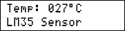

## PIC Programming Exercises
I'm uploading my personal files on the repository.

### Gallery of the Repository

### List of the Repository
|Title|mikroC for PIC|PIC Basic PRO|
|:----|:------------:|:-----------:|
|[ADC](ADC)|Y|-|
|[Button](Button)|Y|-|
|[Sensor_Thermometer_LM35](Sensor_Thermometer_LM35)|Y|-|
|[UART](UART)|Y|-|