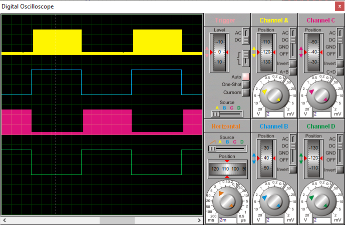

## Sine Wave Generation

SPWM frequency:		16KHz  
Sine Wace frequency:	50Hz  
 
MCU:			PIC16F877A  
Frequency:     		16MHz (External Crystal)   

### Folder and Files Description
It has included:
- `Code_mikroC for PIC` (Code with C Language)
- `Simulate` (Simulator File)

### Simulate: v1.0

Principle of switching and waveforms Full bridge:

[Image URL](https://forums.aeva.asn.au/viewtopic.php?p=92624#p92624)

My GitHub Account: [GitHub.com/AliRezaJoodi](https://github.com/AliRezaJoodi)  
**Note**: [You can go here to download a single folder or file from GitHub.com](https://minhaskamal.github.io/DownGit/#/home)
